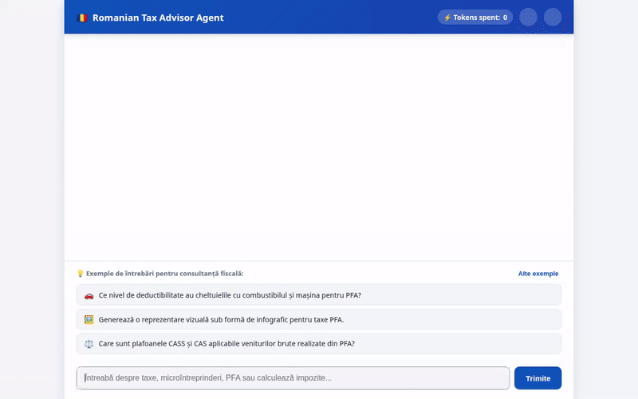

# Romanian Tax Advisor Agent 🇷🇴

An intelligent, multi-tool AI Tax Advisor built with the Google Agent Development Kit (ADK), deployed on Vertex AI Agent Engine, and paired with an interactive streaming web frontend.



---

## 🌟 Overview

The **Romanian Tax Advisor Agent** assists individuals, sole proprietors (PFA), and business owners (micro-enterprises, SRL) in navigating the complex Romanian Tax Code (*Codul Fiscal*). It automatically retrieves official legal articles, calculates detailed tax liabilities, queries live currency exchange rates from the National Bank of Romania (BNR), manages tax rate catalogs in Google Cloud Firestore, runs Python tax simulations, generates visual tax infographics, and streams interactive A2UI cards in real-time.

---

## 🛠️ Fully Implemented Tools & Features

The following tools and services are directly implemented and wired up in `app/agent.py` and `frontend/main.py`:

### 📚 1. Retrieval-Augmented Generation (RAG) Tools
- **`search_fiscal_code`**: Performs semantic search across the 2023 Romanian Fiscal Code (*Codul Fiscal*) and Methodological Norms (*Norme Metodologice*).
- **`lookup_fiscal_article`**: Direct lookup of exact legal articles by number (e.g., *Articolul 47*, *Articolul 120*, *Articolul 291*).

### 🧮 2. Tax Liability Calculator Engine
- **`calculate_tax_liability`**: Calculates comprehensive tax breakdowns:
  - **Micro-enterprises**: 1% vs 3% revenue tax based on employee thresholds and turnover rules.
  - **PFA (Authorized Physical Persons)**: 10% income tax, CAS (pension), and CASS (health) contributions across statutory minimum wage salary tiers (6, 12, 24 salary caps).
  - **Dividends**: 8% dividend tax rate and health contribution thresholds.

### 🗄️ 3. Google Cloud Firestore Tax Rate Catalog
- **`get_tax_rates_catalog`**: Queries statutory tax rates, thresholds, and statutory minimum wage caps stored in Google Cloud Firestore.
- **`save_tax_rate`**: Saves and updates tax rates and category definitions directly into Cloud Firestore.

### 💱 4. Financial & Media Generation Tools
- **`get_latest_exchange_rates`**: Fetches live and historical exchange rates (EUR, USD, GBP, CHF to RON) from the National Bank of Romania (BNR).
- **`generate_tax_infographic`**: Generates visual tax charts, diagrams, and summaries using Vertex AI Imagen and stores generated assets in Google Cloud Storage.

### 🐍 5. Python Execution Sandbox
- **`code_executor`**: Executes Python code in a secure sandbox to model comparative tax scenarios, multi-year financial projections, and custom calculations.

### 🧠 6. Google Cloud Agent Engine & A2UI Capabilities
- **Memory Bank**: Session and conversation state persistence backed by Google Agent Engine Memory Service (`memory_service_uri`).
- **A2UI Dynamic Components**: Intercepts model responses via `a2ui_callback` to emit rich UI cards (data tables, summary cards, action items).
- **Real-Time Streaming Proxy**: FastAPI SSE endpoint streaming token deltas, live status badges (`⚡ Agentul procesează...`), and tool execution tags (`[Tool: ...]`).

---

## 📐 Architecture

```
┌─────────────────────────────────────────────────────────────┐
│                    Web Frontend (UI)                        │
│   • 80% Page Width Container  • Dark/Light Theme Toggle     │
│   • Vertical Sentence Prompts • Token Counter & Copy Button │
└──────────────────────────────┬──────────────────────────────┘
                               │ SSE Streaming (/chat)
┌──────────────────────────────▼──────────────────────────────┐
│                  FastAPI Proxy (frontend/main.py)           │
│   • A2A Client Protocol       • Instant Delta Streaming     │
│   • Automatic Resend/Retry    • A2UI Sanitizer & Parser     │
└──────────────────────────────┬──────────────────────────────┘
                               │ A2A Protocol / gRPC
┌──────────────────────────────▼──────────────────────────────┐
│           Vertex AI Agent Engine (AdkApp runtime)           │
│   • Gemini Flash Engine       • Memory Bank Service         │
│   • RAG Vector Index          • Firestore DB Catalog        │
│   • Vertex AI Imagen (GCS)    • Python Code Executor        │
└─────────────────────────────────────────────────────────────┘
```

---

## 🚀 Local Setup & Running Instructions

### Prerequisites
- Python 3.10+
- Google Cloud SDK (`gcloud`) authenticated with Application Default Credentials (`gcloud auth application-default login`)
- Node.js & npm (optional, for browser test automation)

### 1. Installation
Clone the repository and install dependencies using `uv` or `pip`:

```bash
pip install -r pyproject.toml
```

### 2. Environment Configuration
Create a `.env` file in the project root:

```ini
AGENT_ENGINE_RESOURCE_NAME=projects/<YOUR_PROJECT_ID>/locations/us-east1/reasoningEngines/<ENGINE_ID>
AGENT_DIRECTORY=app
GCP_PROJECT=<YOUR_PROJECT_ID>
GCP_REGION=us-east1
```

### 3. Seed Firestore Database (Optional)
To populate the tax rate catalog in Cloud Firestore:

```bash
python seed_firestore.py
```

### 4. Launch the Application Locally
Start the FastAPI server:

```bash
python frontend/main.py
```

Or using `uvicorn` directly:

```bash
python -m uvicorn frontend.main:app --host 0.0.0.0 --port 8080
```

Once started, open your web browser and navigate to port `8080` on your host machine to interact with the tax advisor interface.

---

## 🧪 Testing

Run unit tests and verification suites:

```bash
pytest tests/
```

To record an automated Playwright browser test demo:

```bash
node record_all_tools_demo.js
```

---

## 📄 License

This project is licensed under the Apache 2.0 License.
